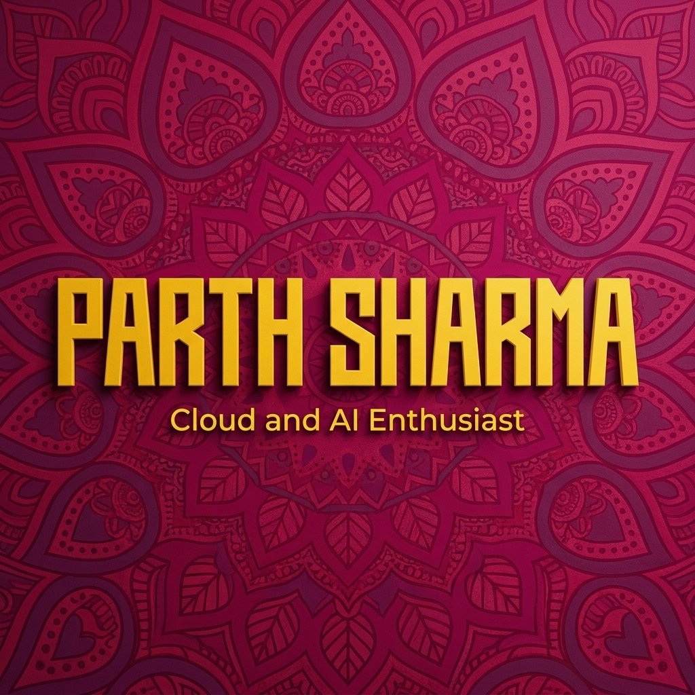

# 💫 Parth Sharma
### Full-Stack Architect & Cloud Specialist

  <a href="#about">About</a> •
  <a href="#projects">Projects</a> •
  <a href="#skills">Skills</a> •
  <a href="#stats">Stats</a> •
  <a href="https://prsagency.gt.tc" target="_blank">Agency</a> •
  <a href="https://prsprojects.gt.tc" target="_blank">Portfolio</a>

---

 
  

## 🚀 About Me

Highly experienced developer specializing in comprehensive cloud solutions (**AWS, Azure, GCP**) and cross-platform mobile ecosystems (**Android, iOS, React Native, Flutter, Swift**). Expert in architecting scalable backends with **Node.js/Next.js** and crafting premium UI/UX experiences using **Figma, Framer, and Stitch**. Dedicated to **DevOps excellence** and high-performance engineering.

### 🌐 Connect with me:

---

## 📁 Featured Public Repositories (Shortlist)

> *Note: These repositories are recently made public for the community.*

| Project Category | Repository Name (Alias) |
| :--- | :--- |
| **Education** | NMIMS Execute, CampusZero Dash |
| **Artificial Intelligence** | AI Collection, Greenline AI, DL in CV |
| **Cloud & DevOps** | CloudBuild Env, CloudBuild App, Career Command |
| **Web & Portfolio** | Web Dev Hub, Portfolio PWS, Silent Syntax, Client Project 22 |
| **Growth Tools** | Booster 01, Booster 02, Booster 03, Booster 04 |
| **Experimental** | Zenture Stride, Sample App |

---

## 🎓 Education

**Symbiosis University of Applied Sciences, Indore** (2024 – 2028)
B.Tech in Computer Science & Information Technology • CGPA: 8.5/10

---

## 💻 Tech Stack

### Languages
     

### Frontend
    

### Backend
    

### Cloud & DevOps
        

### Database
    

### AI/ML & System Design
     

### Monitoring
  

---

## 🏆 Key Achievements

- **3x Cloud Badges**: AWS Solutions Architect, GCP Cloud Engineer, Azure DevOps Expert
- **40k+ Stars** on DevOps and Cloud projects with active community contributions
- **3 Hackathon Wins** out of 8 participated, with additional top-10 finishes
- **Open Source Contributor** with accepted PRs to Kubernetes, Terraform, and React

---

## 📈 Contribution Activity

---

## 📊 Detailed Stats

---

<!-- Proudly created with GPRM ( https://gprm.itsvg.in ) -->

